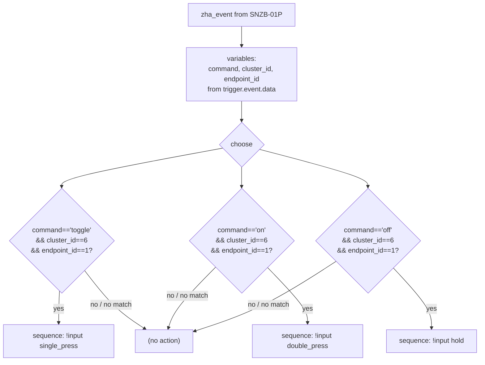
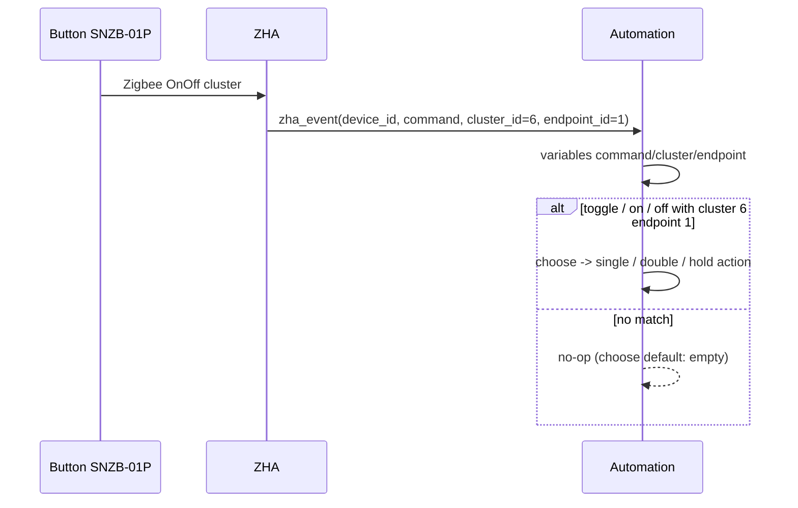

# ZHA — Sonoff SNZB-01P Button — `button-sonoff-znzb-01p.yml`

> **File:** `blueprints/button-sonoff-znzb-01p.yml` · **Domain:** `automation` · **Min HA:** `2025.1.0`
> **Mode:** `restart` (`max_exceeded: silent`) · **Author:** `voronenko`

Map the 3 ZHA `zha_event` payloads from one SNZB-01P button to 3 user actions (single / double / hold).

---

## 1) Inputs

| Input | Selector | Default | Meaning |
|---|---|---|---|
| `remote` | `device` `integration: zha` `manufacturer: eWeLink` `model: SNZB-01P` `multiple: false` | — (required) | The SNZB-01P device. Its `device_id` pins the `zha_event` trigger. |
| `single_press` | `action` | `[]` | Action run when `command == "toggle"` (`cluster_id == 6`, `endpoint_id == 1`). |
| `double_press` | `action` | `[]` | Action run when `command == "on"` (`cluster_id == 6`, `endpoint_id == 1`). |
| `hold` | `action` | `[]` | Action run when `command == "off"` (`cluster_id == 6`, `endpoint_id == 1`). |

> **Device filtering note:** `model: SNZB-01P` vs `SNZB-01` — the blueprint binds to `SNZB-01P` only; an older `SNZB-01` device will not match the selector and will not appear as a choice.

---

## 2) Variables (why `!input` → `variables:`)

`!input remote` appears in `triggers[].event_data.device_id` (allowed) and is additionally bound via `variables:` as `remote_device_id` for Jinja/template access without repeating `!input` inside Jinja (lint `BP012`). The runtime `command`/`cluster_id`/`endpoint_id` are extracted from `trigger.event.data` in the first `actions[]` step.

```yaml
variables:
  remote_device_id: !input remote
```

Runtime (first action step):

```yaml
- variables:
    command: "{{ trigger.event.data.command }}"
    cluster_id: "{{ trigger.event.data.cluster_id }}"
    endpoint_id: "{{ trigger.event.data.endpoint_id }}"
```

---

## 3) Trigger

```yaml
triggers:
  - trigger: event
    event_type: zha_event
    event_data:
      device_id: !input remote
```

Fires on every `zha_event` from the selected device. The `device_id` filter scopes it — other Zigbee devices do not fire it. With `mode: restart`, a rapid second press restarts the running instance (prior `choose` is superseded).

> **Syntax upgrade (HA 2024.10+):** `trigger: - platform: event` → `triggers: - trigger: event` and `action:` → `actions:` (`HA100`/`HA102`).

---

## 4) Gate / Dispatch — `actions[]`

The first step binds `command`/`cluster_id`/`endpoint_id`; the second is a `choose` with 3 branches. Each branch gates on `condition: template` (not raw Jinja `{{ ... }}` — upgraded to `conditions: [condition: template, value_template: "..."]`) so HA evaluates them as template conditions. An entry fires only when **all 3** predicates hold.



| `command` | `cluster_id` | `endpoint_id` | Fires |
|---|---|---|---|
| `toggle` | `6` | `1` | `single_press` |
| `on` | `6` | `1` | `double_press` |
| `off` | `6` | `1` | `hold` |
| anything else / cluster/endpoint mismatch | — | — | none (`choose` falls through) |



---

## 5) Actions

Each branch's `sequence` is the user-supplied `action` input (any valid HA action(s)). Default `[]` means "do nothing" for an unconfigured press. With `mode: restart`, a second press while a prior action is still running cancels and re-dispatches.

---

## 6) Edge cases & gotchas

| Case | Behavior |
|---|---|
| `zha_event` from a different device | Filtered by `triggers[].event_data.device_id` — ignored. |
| Unknown `command` / wrong `cluster_id` / `endpoint_id` | No branch fires; `choose` has no `default` — no-op. |
| No press actions configured (`[]`) | Branch fires but executes an empty sequence — harmless. |
| Two presses in rapid succession | `mode: restart` restarts the automation; prior `choose` superseded. |
| `!input` inside Jinja (`BP012`) | Avoided via `variables: remote_device_id` + runtime `variables`. |
| Legacy `trigger:` / `action:` syntax (`HA100`/`HA102`) | Migrated to `triggers:` / `actions:` + `trigger: event` / `condition: template`. |
| Re-import / updates | `source_url` points to `Voronenko/ha-blueprints` for blueprint re-import. |
| `SNZB-01` vs `SNZB-01P` | Selector pins `model: SNZB-01P`; older `SNZB-01` will not match. |

---

## 7) Validation & tests

- **Lint:** `make lint` → `yamllint` + `scripts/ha_blueprint_lint.py` (codes `BP002`-`BP020`, `HA100`-`HA120`, `YAML001/002`). `make lint-native` → `BLUEPRINT_SCHEMA` + `Template.ensure_valid` (`homeassistant==2025.1.4`, py 3.12).
- **Tests:** `tests/helpers.py` harness + `tests/test_button_sonoff_znzb_01p.py` cover trigger `zha_event`, `choose` routing (`toggle`→single, `on`→double, `off`→hold), guard on `cluster_id`/`endpoint_id`, no-match fallthrough, mode/selector contract. `tests/test_native_ha.py` parametrizes `BLUEPRINT_SCHEMA` + `Template.ensure_valid` over both blueprints.
- **Acceptance (opt-in):** `make acceptance` per `YAML_FILES` (see File map).

---

## 8) File map

```
blueprints/button-sonoff-znzb-01p.yml <- this doc
blueprints/motion-illuminance.yaml    <- sibling blueprint (same lint/native plumbing)
tests/helpers.py                      <- blueprint loader + Jinja mock harness
tests/test_button_sonoff_znzb_01p.py  <- unit tests for this blueprint
tests/test_native_ha.py               <- native HA schema/template (both blueprints)
scripts/ha_blueprint_lint.py          <- semantic linter
scripts/ha_blueprint_native_check.py  <- native validator
docs/button-sonoff-znzb-01p.md         <- (this file)
```
