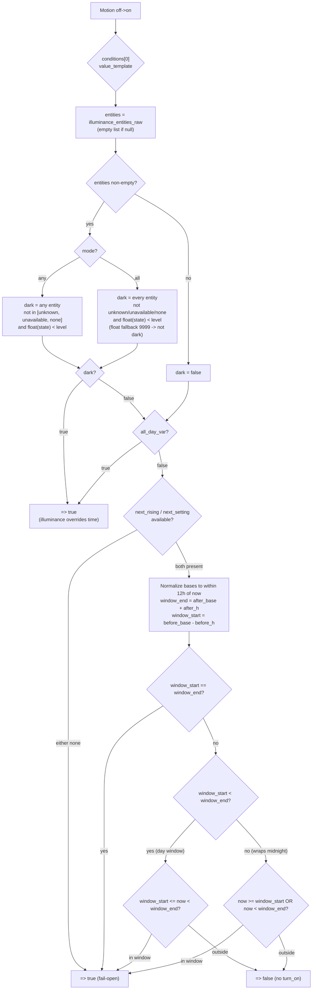
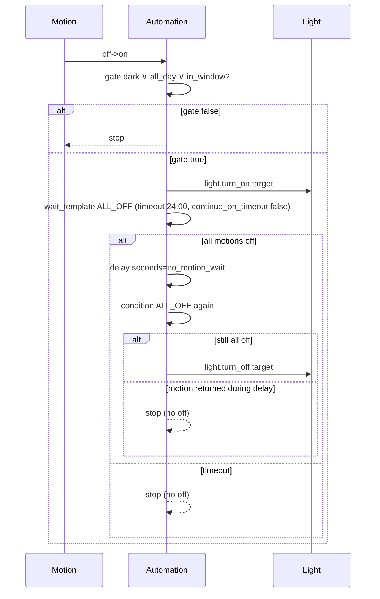

# Motion-activated Light — `motion-illuminance.yaml`

> **File:** `blueprints/motion-illuminance.yaml` · **Domain:** `automation` · **Min HA:** `2025.1.0`
> **Mode:** `restart` (`max_exceeded: silent`) · **Author:** `voronenko` · **Source:** [gist/Danielbook](https://gist.github.com/Danielbook/7814e7eb32e880b2d7c3fb5ba8430f4f)

Turn on a light on motion when it is **dark** by illuminance **OR** the current time is inside the **sun window** (or `All day` is enabled). Dark overrides time. No illuminance sensors means time-window only.

---

## 1) Inputs

| Section | Field | Selector | Default | Meaning |
|---|---|---|---|---|
| `devices` | `motion_entity` (legacy) | `entity` `binary_sensor` `motion` | `null` | Single legacy sensor. Prefer list below. |
|  | `motion_entities` | `entity` list `multiple: true` `binary_sensor` `motion` | `[]` | 1..N sensors. **Any** `off→on` triggers (corridor with 2 parts). Empty → fall back to legacy. |
|  | `light_target` | `target` `light` | — | Light(s) to control. |
| `illuminance` (collapsed) | `illuminance_entities` | `entity` list `multiple: true` `sensor` `illuminance` | `[]` | 0..N sensors. `[]` disables illuminance check. **List-only** (legacy `lux_entity` removed). |
|  | `lux_level` | `number` 0–1000 step 1 slider | `100` | Threshold. Dark = `state < level` (float). |
|  | `illuminance_mode` | `select` `any` / `all` (list) | `any` | `any` = one sensor below → dark. `all` = every sensor below → dark. |
| `time_window` (collapsed) | `all_day` | `boolean` | `false` | When `true`, window covers 24/7 (sun calculation skipped). |
|  | `hours_after_sunrise` | `number` 0–12 step 0.5 `hours` | `2` | Window end = `sunrise + H_after`. |
|  | `hours_before_sunset` | `number` 0–12 step 0.5 `hours` | `2` | Window start = `sunset − H_before`. |
| `settings` (collapsed) | `no_motion_wait` | `number` 0–3600 step 1 `seconds` | `120` | Seconds to keep light after **all** motions are `off`. |

---

## 2) Variables (why `!input` → `*_var`)

`!input` must not appear inside Jinja `{{ }}`/`` (lint `BP012`) and `delay: !input` needs `seconds:` form (`HA120`). Variables bind each `!input` to a Jinja-usable name:

```
legacy_motion_entity  = !input motion_entity
motion_entities_raw   = !input motion_entities
illuminance_entities_raw = !input illuminance_entities
lux_level_var, illuminance_mode_var, all_day_var,
hours_after_sunrise_var, hours_before_sunset_var, no_motion_wait_var
```

---

## 3) Triggers

```yaml
triggers:
  - trigger: state  entity_id: !input motion_entity    from: "off" to: "on"
  - trigger: state  entity_id: !input motion_entities  from: "off" to: "on"
```

Either trigger fires the automation. For the list, HA expands it — any member `off→on` fires. With `mode: restart`, a new firing restarts a running instance (prior `wait`/`delay` is cancelled).

---

## 4) Gate condition — `conditions[0].value_template`

Evaluated after trigger. Returns `true` → continue to `light.turn_on`; `false` → stop. Precedence: **dark → all_day → sun window**.



### 4.1 Illuminance details

- `level = lux_level_var | float(0)`, `mode = illuminance_mode_var | default('any', true)`.
- `any`: `states(e) not in ['unknown','unavailable', none] and float(9999) < level` for at least one `e`.
- `all`: every `e` must satisfy the same predicate; any `unknown`/`unavailable`/`none` or `>= level` makes `dark = false`.
- No entities → `dark = false`, fall through to time logic.

### 4.2 All-day

`all_day_var` (`!input all_day`) is checked immediately after `dark`. When `true`, the template returns `true` without touching `sun.sun`. Covers full 24 h — even a bright `500 lx` at noon passes. Tested in `test_all_day_covers_full_day`.

### 4.3 Sun window

```
after_h  = hours_after_sunrise_var | float(2)
before_h = hours_before_sunset_var | float(2)
next_rising  = as_datetime(state_attr('sun.sun','next_rising'))
next_setting = as_datetime(state_attr('sun.sun','next_setting'))
# null -> true (fail-open, avoids blocking when sun integration is missing)
```

Bases are snapped to the event nearest `now` (shift ±1 day if >12 h away), so `next_rising`/`next_setting` being "tomorrow" vs "today" does not matter:

```
after_base  = next_rising  ± 1 day to be within 12h of now
before_base = next_setting ± 1 day to be within 12h of now
window_end   = after_base + timedelta(hours=after_h)
window_start = before_base - timedelta(hours=before_h)
```

In-window test handles wrap-around midnights:

```
if window_start == window_end: true
elif window_start < window_end: window_start <= now < window_end
else: now >= window_start or now < window_end
```

**Example** — sunrise `06:00`, sunset `18:00`, `H=2` each → `window_start=16:00`, `window_end=08:00` (wraps). In-window at `16:00`, `22:00`, `07:00`; out at `12:00`, `08:00`, `15:00`. See `test_defaults_2h_each_match_description`.

```mermaid
gantt
  title Sun window 16:00 -> 08:00 (wraps midnight)
  dateFormat HH:mm
  axisFormat %H:%M
  section Window
  In window (16-24, 00-08) : 16:00, 08:00
  Out (08-16)             : 08:00, 16:00
```



---

## 5) Actions



Steps in YAML:

1. `action: light.turn_on` → `target: !input light_target`
2. `wait_template` — `ALL_OFF(motions)` (up to `24:00:00`, `continue_on_timeout: false`):
   ```
   motions = motion_entities_raw if non-empty else [legacy_motion_entity] else []
   [] -> true
   else all_off = every is_state(m,'on')? false : true  -> {{ ns.all_off }}
   ```
   Same expression is used for the post-delay re-check (second template condition). With `mode: restart`, a new motion during `wait`/`delay` restarts the run — the prior wait is abandoned and the light stays on.
3. `delay: {seconds: !input no_motion_wait}` — structured form required (`HA120`).
4. `condition: template` — identical `ALL_OFF` check. Guards against motion returning during the delay (race avoidance).
5. `action: light.turn_off` → same target.

If `motions` resolves to `[]` (no motion entity configured), both checks return `true` immediately — the sequence degrades to turn_on → delay → turn_off.

---

## 6) Edge cases & gotchas

| Case | Behavior |
|---|---|
| `unknown` / `unavailable` / `none` lux | Treated as **not dark** (`float(9999)` fallback). `any` ignores it; `all` fails. |
| No illuminance entities (`[]`) | Pure time window (or `all_day`). |
| `all_day: true` | Window skipped entirely; bright noon still turns on. |
| `sun.sun` attrs `null` | Gate returns `true` (fail-open) rather than blocking. |
| `window_start == window_end` (e.g. `12h`/`12h`) | Always `true`. |
| Window wraps midnight | `now >= start or now < end` branch. |
| Motion returns during `delay` | Post-delay `ALL_OFF` re-check prevents premature off. |
| `mode: restart` | New trigger restarts; no queued duplicate runs. |
| `!input` in Jinja | Forbidden — must go via `variables:` (`BP012`). |
| `delay: !input` | Must be `delay: {seconds: !input ...}` (`HA120`). |

---

## 7) Validation & tests

- **Lint:** `make lint` → `yamllint` + `scripts/ha_blueprint_lint.py` (codes `BP002`-`BP020`, `HA100`-`HA120`). `make lint-native` → `BLUEPRINT_SCHEMA` + `Template.ensure_valid` (`homeassistant==2024.10.4`, py 3.12).
- **Tests:** `tests/helpers.py` mocks `states`/`is_state`/`state_attr`/`as_datetime`/`now`/`timedelta`/`namespace`; `tests/test_motion_illuminance.py` covers illuminance `any`/`all`, unavailable, empty-list window, `all_day` 24/7, `2h` boundaries (`15F/16T/07T/08F`), and motion `ALL_OFF` for list + legacy. See helpers/tests for harness details.
- **Acceptance (opt-in):** `make acceptance` runs HA `check_config` in `ghcr.io/home-assistant/home-assistant:2024.10` docker.

---

## 8) File map

```
blueprints/motion-illuminance.yaml   <- this doc
tests/helpers.py                     <- Jinja mock harness
tests/test_motion_illuminance.py     <- unit tests (incl. all_day)
tests/test_native_ha.py              <- native HA schema/template test
scripts/ha_blueprint_lint.py         <- semantic linter
scripts/ha_blueprint_native_check.py <- native validator
docs/motion-illuminance.md           <- (this file)
```
