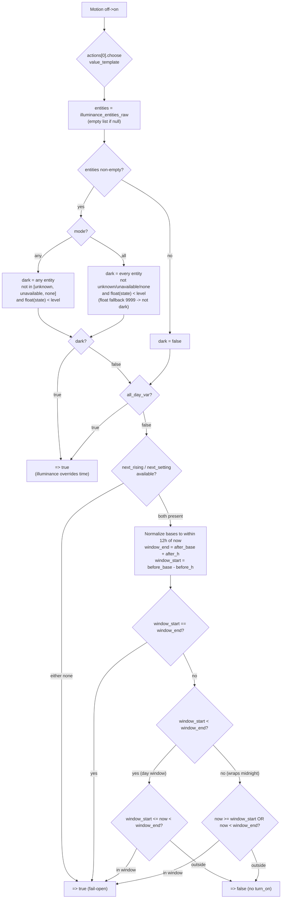
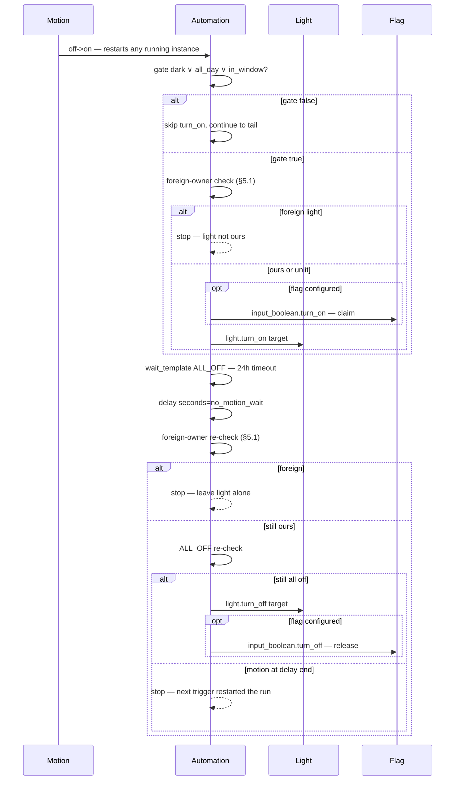
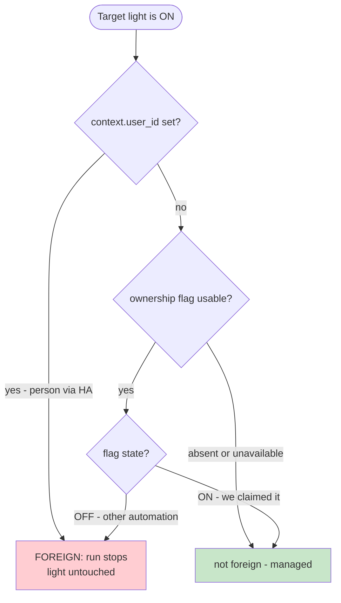

# Motion-activated Light — `motion-illuminance.yaml`

> **File:** `blueprints/motion-illuminance.yaml` · **Domain:** `automation` · **Min HA:** `2025.1.0`
> **Mode:** `restart` (`max_exceeded: silent`) · **Author:** `voronenko` · **Source:** [gist/Danielbook](https://gist.github.com/Danielbook/7814e7eb32e880b2d7c3fb5ba8430f4f)

Turn on a light on motion when it is **dark** by illuminance **OR** the current time is inside the **sun window** (or `All day` is enabled). Dark overrides time. No illuminance sensors means time-window only.

---

## 1) Inputs

| Section | Field | Selector | Default | Meaning |
|---|---|---|---|---|
| `devices` | `motion_entities` | `entity` list `multiple: true` `binary_sensor` `motion` | `[]` | 1..N sensors. **Any** `off→on` triggers (corridor with 2 parts). |
|  | `light_target` | `target` `light` | — | Light(s) to control. |
| `illuminance` (collapsed) | `illuminance_entities` | `entity` list `multiple: true` `sensor` `illuminance` | `[]` | 0..N sensors. `[]` disables illuminance check. **List-only** (legacy `lux_entity` removed). |
|  | `lux_level` | `number` 0–1000 step 1 slider | `100` | Threshold. Dark = `state < level` (float). |
|  | `illuminance_mode` | `select` `any` / `all` (list) | `any` | `any` = one sensor below → dark. `all` = every sensor below → dark. |
| `time_window` (collapsed) | `all_day` | `boolean` | `false` | When `true`, window covers 24/7 (sun calculation skipped). |
|  | `hours_after_sunrise` | `number` 0–12 step 0.5 `hours` | `2` | Window end = `sunrise + H_after`. |
|  | `hours_before_sunset` | `number` 0–12 step 0.5 `hours` | `2` | Window start = `sunset − H_before`. |
| `settings` (collapsed) | `no_motion_wait` | `number` 0–3600 step 1 `seconds` | `120` | Seconds to keep light after **all** motions are `off`. |
|  | `ownership_flag` | `entity` `input_boolean` (optional) | `[]` | Helper the automation turns ON while it owns the light, OFF after releasing it. When set: a light ON with flag OFF = foreign (person or other automation) → untouched. See §5.1. |

---

## 2) Variables (why `!input` → `*_var`)

`!input` must not appear inside Jinja `{{ }}`/`` (lint `BP012`) and `delay: !input` needs `seconds:` form (`HA120`). Variables bind each `!input` to a Jinja-usable name:

```
motion_entities_raw   = !input motion_entities
illuminance_entities_raw = !input illuminance_entities
lux_level_var, illuminance_mode_var, all_day_var,
hours_after_sunrise_var, hours_before_sunset_var, no_motion_wait_var
light_target_var      = !input light_target          (for light_entities_var)
ownership_flag_var    = !input ownership_flag        (optional helper)
light_entities_var    = template: entity_id list from the light target
```

---

## 3) Triggers

```yaml
triggers:
  - trigger: state  entity_id: !input motion_entities  from: "off" to: "on"
```

Either trigger fires the automation. For the list, HA expands it — any member `off→on` fires. With `mode: restart`, a new firing restarts a running instance (prior `wait`/`delay` is cancelled).

---

## 4) Gate — first action (`choose` branch `value_template`)

Evaluated on **every trigger** as the first action — deliberately **not** an automation-level condition. Returns `true` → `light.turn_on`; `false` → skip turning on but **continue into the no-motion tail**. Precedence: **dark → all_day → sun window**.

Why not a top-level condition: `mode: restart` cancels the running instance on every motion `off→on`. If the gate were re-evaluated as a condition and now fails (e.g. the light itself pushed the lux sensor above the threshold, or the sun window closed), the new run dies at the condition while the old run is already gone — the light is stranded ON with nothing running. Keeping the gate inside the actions guarantees the turn-off tail always executes.


```mermaid
flowchart TD
  TRIG["Motion off->on"] --> C{"actions[0].choose\nvalue_template"}
  C --> E["entities = illuminance_entities_raw\n(empty list if null)"]
  E --> DARK{"entities non-empty?"}
  DARK -- "no" --> DARK_NO["dark = false"]
  DARK -- "yes" --> MODE{"mode?"}
  MODE -- "any" --> ANY["dark = any entity\nnot in [unknown, unavailable, none]\nand float(state) < level"]
  MODE -- "all" --> ALL["dark = every entity\nnot unknown/unavailable/none\nand float(state) < level\n(float fallback 9999 -> not dark)"]
  ANY & ALL --> IS_DARK{"dark?"}
  IS_DARK -- "true" --> ALLOW["=> true\n(illuminance overrides time)"]
  IS_DARK -- "false" --> ALLDAY{"all_day_var?"}
  DARK_NO --> ALLDAY
  ALLDAY -- "true" --> ALLOW
  ALLDAY -- "false" --> SUN{"next_rising / next_setting\navailable?"}
  SUN -- "either none" --> ALLOW2["=> true (fail-open)"]
  SUN -- "both present" --> NORM["Normalize bases to within 12h of now\nwindow_end = after_base + after_h\nwindow_start = before_base - before_h"]
  NORM --> EQ{"window_start == window_end?"}
  EQ -- "yes" --> ALLOW2
  EQ -- "no" --> WRAP{"window_start < window_end?"}
  WRAP -- "yes (day window)" --> IN1{"window_start <= now < window_end?"}
  WRAP -- "no (wraps midnight)" --> IN2{"now >= window_start OR now < window_end?"}
  IN1 & IN2 -- "in window" --> ALLOW2
  IN1 & IN2 -- "outside" --> DENY["=> false (no turn_on)"]
```

### 4.1 Illuminance details

- `level = lux_level_var | float(0)`, `mode = illuminance_mode_var | default('any', true)`.
- `any`: `states(e) not in ['unknown','unavailable', none] and float(9999) < level` for at least one `e`.
- `all`: every `e` must satisfy the same predicate; any `unknown`/`unavailable`/`none` or `>= level` makes `dark = false`.
- No entities → `dark = false`, fall through to time logic.

### 4.2 All-day

`all_day_var` (`!input all_day`) is checked immediately after `dark`. When `true`, the template returns `true` without touching `sun.sun`. Covers full 24 h — even a bright `500 lx` at noon passes. Tested in `test_all_day_covers_full_day`.

### 4.3 Sun window

```
after_h  = hours_after_sunrise_var | float(2)
before_h = hours_before_sunset_var | float(2)
next_rising  = as_datetime(state_attr('sun.sun','next_rising'))
next_setting = as_datetime(state_attr('sun.sun','next_setting'))
# null -> true (fail-open, avoids blocking when sun integration is missing)
```

Bases are snapped to the event nearest `now` (shift ±1 day if >12 h away), so `next_rising`/`next_setting` being "tomorrow" vs "today" does not matter:

```
after_base  = next_rising  ± 1 day to be within 12h of now
before_base = next_setting ± 1 day to be within 12h of now
window_end   = after_base + timedelta(hours=after_h)
window_start = before_base - timedelta(hours=before_h)
```

In-window test handles wrap-around midnights:

```
if window_start == window_end: true
elif window_start < window_end: window_start <= now < window_end
else: now >= window_start or now < window_end
```

**Example** — sunrise `06:00`, sunset `18:00`, `H=2` each → `window_start=16:00`, `window_end=08:00` (wraps). In-window at `16:00`, `22:00`, `07:00`; out at `12:00`, `08:00`, `15:00`. See `test_defaults_2h_each_match_description`.


```mermaid
gantt
  title Sun window 16:00 -> 08:00 (wraps midnight)
  dateFormat HH:mm
  axisFormat %H:%M
  section Window
  In window (16-24, 00-08) : 16:00, 08:00
  Out (08-16)             : 08:00, 16:00
```

---

## 5) Actions


```mermaid
sequenceDiagram
  participant M as Motion
  participant A as Automation
  participant L as Light
  participant F as Flag
  M->>A: off->on — restarts any running instance
  A->>A: gate dark ∨ all_day ∨ in_window?
  alt gate false
    A->>A: skip turn_on, continue to tail
  else gate true
    A->>A: foreign-owner check (§5.1)
    alt foreign light
      A-->>A: stop — light not ours
    else ours or unlit
      opt flag configured
        A->>F: input_boolean.turn_on — claim
      end
      A->>L: light.turn_on target
    end
  end
  A->>A: wait_template ALL_OFF — 24h timeout
  A->>A: delay seconds=no_motion_wait
  A->>A: foreign-owner re-check (§5.1)
  alt foreign
    A-->>A: stop — leave light alone
  else still ours
    A->>A: ALL_OFF re-check
    alt still all off
      A->>L: light.turn_off target
      opt flag configured
        A->>F: input_boolean.turn_off — release
      end
    else motion at delay end
      A-->>A: stop — next trigger restarted the run
    end
  end
```

Steps in YAML:

1. `choose` — the gate `value_template` (§4). Match → ownership check (§5.1) → optional flag claim → `light.turn_on`. No match → fall through: the tail below **always runs**, even when the gate is false. This is the stranded-light deadlock fix (see §4).
2. `wait_template` — `ALL_OFF(motions)` (up to `24:00:00`, `continue_on_timeout: false`):
   ```
   motions = motion_entities_raw (empty list if null)
   [] -> true
   else all_off = every is_state(m,'on')? false : true  -> {{ ns.all_off }}
   ```
   Same expression is used for the post-delay re-check (second template condition).
3. `delay: {seconds: !input no_motion_wait}` — structured form required (`HA120`). Because `mode: restart` restarts the automation on any motion `off→on`, this countdown effectively measures time since the **last** motion event, not since the first sensor turned off.
4. `condition: template` — ownership re-check (§5.1, same expression as step 1).
5. `condition: template` — identical `ALL_OFF` check. Guards the race where motion returns exactly around the end of the delay.
6. `action: light.turn_off` → same target, then optional flag release (`input_boolean.turn_off`).

### 5.1 Ownership respect (manual / other automations)

Every light state carries a `context`: `user_id` set ⇒ changed by a **person** through HA (app, dashboard, voice); `user_id` null ⇒ automation/script or physical/integration origin. The automation never turns off a light it doesn't own:

- **Always (stateless):** any target light that is ON with `context.user_id` set is *foreign* → the run stops before `turn_on` and before `turn_off`.
- **With `ownership_flag` helper selected:** additionally, any target light that is ON while the flag is OFF is *foreign* — this is what respects lights turned on by **other automations** (e.g. the button blueprint), whose `user_id` is null. The flag is the only way to tell "my previous run's light" (flag still ON) from "the button automation's light" (flag OFF).

| Light state | Flag | Result |
|---|---|---|
| OFF | any | proceed normally |
| ON, `user_id` set | any | foreign → untouched |
| ON, `user_id` null | OFF / absent | foreign (button/no-flag path per above) |
| ON, `user_id` null | ON | ours → turn off after wait |

Fail-open cases: unavailable/deleted flag entity, area/device light targets (no entity list) → checks are skipped and the automation behaves as before. Known ceiling (marked `ponytail:` in the YAML): after a mid-run HA restart a stale ON flag can mis-claim a light another automation just turned on — it self-heals on the next manual toggle. Physical switches toggling the relay outside HA are not detectable via context.

The checks require the light target to be **entity-based** (`light_entities_var` extracts `entity_id` from the target); with area/device targets the ownership logic is skipped.


```mermaid
flowchart TD
  START([Target light is ON]) --> UID{context.user_id set?}
  UID -->|yes - person via HA| FOREIGN[FOREIGN: run stops<br/>light untouched]
  UID -->|no| FLAG{ownership flag usable?}
  FLAG -->|absent or unavailable| MANAGED[not foreign - managed]
  FLAG -->|yes| FS{flag state?}
  FS -->|ON - we claimed it| MANAGED
  FS -->|OFF - other automation| FOREIGN
  style FOREIGN fill:#ffcdd2
  style MANAGED fill:#c8e6c9
```

### 5.2 Countdown resets on every motion

Because `mode: restart` restarts the run on each motion `off→on`, the light goes off `no_motion_wait` after the **last** motion clears — extra motion events extend the on-period, they never shorten it:


```mermaid
gantt
  title Light off at last motion clear + 120 s
  dateFormat HH:mm:ss
  axisFormat %H:%M:%S
  section Motion
  sensor A :a1, 15:26:33, 15:27:00
  sensor B :a2, 15:27:45, 15:28:10
  sensor A :a3, 15:29:00, 15:29:05
  section Light
  corridor ON :crit, 15:26:33, 15:31:05
```

If `motions` resolves to `[]` (no sensors configured), both checks return `true` immediately — the sequence degrades to turn_on → delay → turn_off.

---

## 6) Edge cases & gotchas

| Case | Behavior |
|---|---|
| `unknown` / `unavailable` / `none` lux | Treated as **not dark** (`float(9999)` fallback). `any` ignores it; `all` fails. |
| No illuminance entities (`[]`) | Pure time window (or `all_day`). |
| `all_day: true` | Window skipped entirely; bright noon still turns on. |
| `sun.sun` attrs `null` | Gate returns `true` (fail-open) rather than blocking. |
| `window_start == window_end` (e.g. `12h`/`12h`) | Always `true`. |
| Window wraps midnight | `now >= start or now < end` branch. |
| Motion returns during `delay` | `mode: restart` restarts the run (countdown resets); the post-delay `ALL_OFF` re-check guards the end-of-delay race. |
| Gate false while light already on | Turn-off tail still runs → light goes off after `no_motion_wait`, **unless** the light is foreign-owned (§5.1) — then it is left untouched. |
| Light ON with `context.user_id` set | Foreign (person via HA) → no `turn_on` over it, no `turn_off` under it. |
| Light ON, flag OFF (flag configured) | Foreign (other automation, e.g. button) → untouched. |
| Area/device light target | Ownership checks skipped (no entity list) → previous behavior. |
| `mode: restart` | New trigger restarts; no queued duplicate runs. |
| `!input` in Jinja | Forbidden — must go via `variables:` (`BP012`). |
| `delay: !input` | Must be `delay: {seconds: !input ...}` (`HA120`). |

---

## 7) Validation & tests

- **Lint:** `make lint` → `yamllint` + `scripts/ha_blueprint_lint.py` (codes `BP002`-`BP020`, `HA100`-`HA120`). `make lint-native` → `BLUEPRINT_SCHEMA` + `Template.ensure_valid` (`homeassistant==2024.10.4`, py 3.12).
- **Tests:** `tests/helpers.py` mocks `states`/`is_state`/`state_attr`/`as_datetime`/`now`/`timedelta`/`namespace`; `tests/test_motion_illuminance.py` covers illuminance `any`/`all`, unavailable, empty-list window, `all_day` 24/7, `2h` boundaries (`15F/16T/07T/08F`), and motion `ALL_OFF` for the list. See helpers/tests for harness details.
- **Acceptance (opt-in):** `make acceptance` runs HA `check_config` in `ghcr.io/home-assistant/home-assistant:2024.10` docker.

---

## 8) File map

```
blueprints/motion-illuminance.yaml   <- this doc
tests/helpers.py                     <- Jinja mock harness
tests/test_motion_illuminance.py     <- unit tests (incl. all_day)
tests/test_native_ha.py              <- native HA schema/template test
scripts/ha_blueprint_lint.py         <- semantic linter
scripts/ha_blueprint_native_check.py <- native validator
docs/motion-illuminance.md           <- (this file)
```
